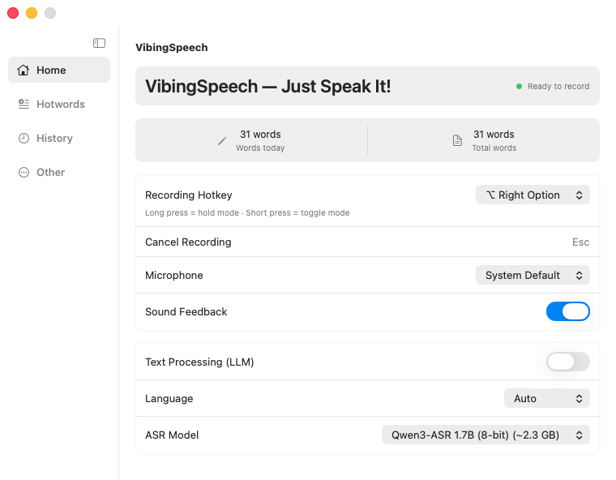
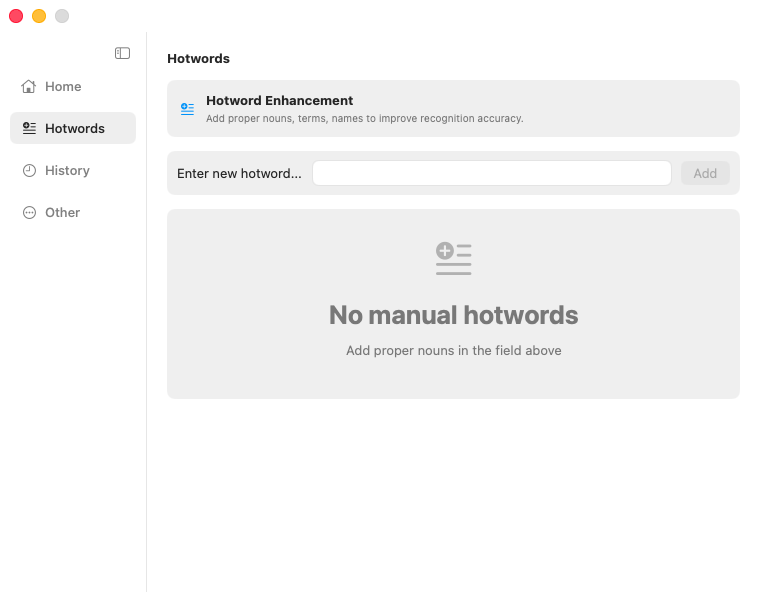
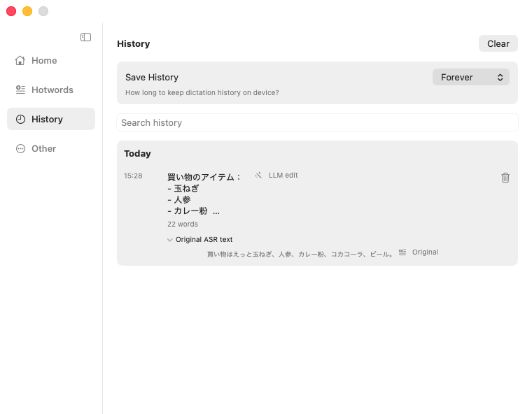
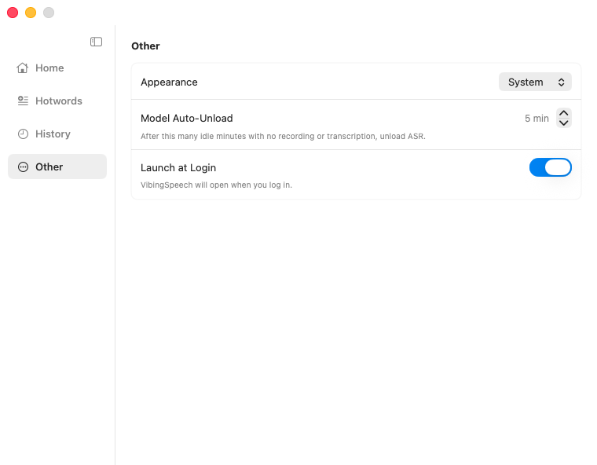

<table>
  <thead>
    <tr>
      <th style="text-align:center"><a href="README_ja.md">日本語</a></th>
      <th style="text-align:center"><a href="README.md">English</a></th>
    </tr>
  </thead>
</table>

# VibingSpeech

VibingSpeech は、Apple Silicon Mac 向けのネイティブ macOS 音声入力ユーティリティです。メニューバー常駐アプリとして動作し、グローバルホットキーで録音を開始し、Qwen3-ASR を使用してローカルで音声をテキストに変換します。録音中にオプションのライブ文字起こし表示が可能で、必要に応じてローカルの Qwen3 LLM で最終テキストを整形し、システムのペーストボードを通じて最前面のアプリに結果を貼り付けます。

## 目次

- [プレビュー](#preview)
- [機能](#features)
- [技術スタック](#tech-stack)
- [動作要件](#requirements)
- [ビルドと実行](#build-and-run)
- [使い方](#usage)
- [テスト](#testing)
- [アーカイブ](#archive)
- [プロジェクト構成](#project-structure)
- [権限とプライバシー](#permissions-and-privacy)
- [トラブルシューティング](#troubleshooting)
- [ライセンス](#license)

## プレビュー









## 機能

- 短押しトグルモードと長押しホールドモードに対応したグローバル録音ホットキー。
- ライブ音量フィードバックと文字起こし状態を表示するフローティング録音オーバーレイ。
- 録音中に別のオーバーレイで部分的・確定済みの ASR テキストを表示するオプションのライブ文字起こしモード（録音停止時に一度だけ貼り付けを実行）。
- Qwen3-ASR 0.6B、1.7B 4-bit、1.7B 8-bit MLX バリアントに対応したローカル ASR モデル選択。
- `mlx-community/Qwen3-4B-Instruct-2507-4bit` を使用した、誤字修正・箇条書きフォーマット・カスタムプロンプトに対応するオプションのローカルテキスト処理（LLM）。
- システムのデフォルトに依存せず、録音エンジンに選択した入力デバイスを適用する Core Audio マイク選択。
- 名前・用語・固有名詞のローカルホットワードマネージャー。
- 保持設定・検索・コピー・削除・クリア・元の ASR コピー操作に対応したローカル文字起こし履歴。
- アプリ全体の外観モード、ログイン時に起動、アイドル時のモデル自動アンロード設定。
- クリップボードの復元機能付きで、アクティブなアプリへ安全にテキストを挿入。
- Dock アイコンなしのメニューバーライフサイクル。
- 起動時の Apple Silicon 確認ガード。

## 技術スタック

- macOS アプリ・メニューバーアイテム・録音オーバーレイに SwiftUI と AppKit を使用。
- マイクキャプチャ・デバイス選択・音声変換に AVFoundation と Core Audio を使用。
- グローバルホットキーと疑似ペーストに Carbon と Core Graphics イベントタップを使用。
- Qwen3-ASR、音声サポート、および `SpeechVAD` を使用したライブ文字起こしに `speech-swift` `0.0.19` を使用。
- ローカル Qwen3 テキスト処理に `mlx-swift-lm` `3.31.3`（`mlx-swift` `0.31.3`、`swift-huggingface` `0.9.0`、`swift-transformers` `1.3.3` を含む）を使用。
- ログイン時に起動に ServiceManagement を使用。
- ローカル履歴とホットワードの永続化に Application Support 内の JSON ファイルを使用。

## 動作要件

- Apple Silicon Mac。
- macOS 26.0 以降。
- Xcode 26.5 以降。
- Metal ツールチェーン。Xcode の設定 → コンポーネントタブ → その他のコンポーネント → Metal Toolchain。
- マイクの使用許可。
- グローバルホットキーとアプリ間ペーストのためのアクセシビリティ権限。

## ビルドと実行

リポジトリのルートからプロジェクトスクリプトを使用します：

```sh
./script/build_and_run.sh --verify
```

このスクリプトは `VibingSpeech.xcodeproj` をビルドし、Debug アプリバンドルを起動して、`VibingSpeech` プロセスが実行中であることを確認します。

その他のサポートされているモード：

```sh
./script/build_and_run.sh
./script/build_and_run.sh --logs
./script/build_and_run.sh --telemetry
./script/build_and_run.sh --debug
```

Xcode プロジェクトが主要なビルドパスです。このアプリでは SwiftPM のみのリリースビルドは意図的に使用していません。

## 使い方

1. VibingSpeech を起動します。
2. macOS からマイクへのアクセス許可を求められたら許可します。
3. システム設定 > プライバシーとセキュリティ > アクセシビリティ で VibingSpeech を有効にします。
4. ホーム画面から録音ホットキー・マイク・テキスト処理モード・言語モード・ASR モデルを選択します。
5. 任意のアプリで録音ホットキーを押します。離すか再度押すと録音が停止し、VibingSpeech が文字起こしを行い最終テキストを貼り付けます。

デフォルトのホットキーは右 Option キーです。Escape キーでアクティブな録音をキャンセルできます。

ライブ文字起こしが有効な場合、録音中にコンパクトな録音オーバーレイの上部に部分的・確定済みの ASR テキストが表示されます。テキストをリアルタイムでターゲットアプリに貼り付けることはせず、録音停止後にオプションのテキスト処理が完全な文字起こしに対して実行されてから、一度だけ挿入が行われます。

ホットワードを使用して名前やドメイン用語のローカルリストを管理し、履歴で保存された音声入力を検索・コピーし、その他の設定で外観・ログイン時に起動・モデルの自動アンロードタイミングを設定します。

## テスト

以下のコマンドでアプリのユニットテストを実行します：

```sh
xcodebuild -project VibingSpeech.xcodeproj \
  -scheme VibingSpeech \
  -configuration Debug \
  -destination 'platform=macOS,arch=arm64' \
  -derivedDataPath DerivedData \
  CODE_SIGNING_ALLOWED=NO \
  -only-testing:VibingSpeechTests \
  test
```

現在のテストは、モデルメタデータ・プロンプト生成・言語正規化・単語数カウント・ライブ文字起こしバッファリング・短い音声の ASR ガード・設定の永続化・モデルアンロード遅延の境界値・履歴の保持・破損した履歴の復元・ホットワードの検証・ペーストボードの復元をカバーしています。

## アーカイブ

アプリが `speech-swift` に依存している間は、Xcode の GUI のアーカイブボタンを使用しないでください。リリースパッケージのビルドで `SpeechVAD` が x86_64 向けにコンパイルされ、`Float16` でのビルドが失敗する場合があります。

代わりにアーカイブスクリプトを使用してください：

```sh
./script/archive.sh
```

スクリプトは以下を生成します：

- `build/VibingSpeech.xcarchive`
- `build/VibingSpeech.app`

アーカイブのワークフローでは `ARCHS=arm64` を渡し、アプリバンドルの前にネストされたコードに署名し、`VibingSpeech/Resources/VibingSpeech.entitlements` を保持し、Hardened Runtime を有効にし、ランタイムフラグが存在することを確認して、Apple Silicon 専用アプリを生成します。

## プロジェクト構成

```text
VibingSpeech/
├── VibingSpeech.xcodeproj
├── VibingSpeech/
│   ├── App/              # アプリのエントリポイントとコーディネーター
│   ├── Core/             # 共有アプリの列挙型とヘルパー
│   ├── Models/           # ドメインモデル
│   ├── Persistence/      # 設定・履歴・ホットワードストア
│   ├── Resources/        # Info.plist とアセットカタログ
│   ├── Services/         # ホットキー・音声・ASR・テキスト挿入・権限
│   ├── Support/          # フォーマットヘルパー
│   └── Views/            # SwiftUI ビューとオーバーレイパネル
├── VibingSpeechTests/
├── VibingSpeechUITests/
├── docs/
└── script/
```

## 権限とプライバシー

VibingSpeech は録音のためにマイクへのアクセスが必要です。グローバルホットキーと最前面のアプリへのテキスト挿入にはアクセシビリティ権限が必要です。

音声はローカルで処理されます。ホットワード・設定・文字起こし履歴はデバイス上に保存されます。ASR またはテキスト処理モデルを初回使用時に Hugging Face からダウンロードする際には、ネットワークアクセスが発生します。

## トラブルシューティング

ホットキーが機能しない場合は、システム設定 > プライバシーとセキュリティ > アクセシビリティ で VibingSpeech を有効にしてから、アプリ内の「ホットキー設定を再試行」を使用してください。

表示されているマイクを変更しても録音が別のデバイスを使用しているように見える場合は、アクティブな録音を停止して新しい録音を開始してください。VibingSpeech は録音セッション開始時に選択された Core Audio デバイスを適用し、そのデバイスが利用できない場合や有効化できない場合はエラーを報告します。

録音が開始してすぐに停止する場合、VibingSpeech は ASR に対して短すぎる音声を `speech-swift` に送信せず破棄します。

Xcode の GUI からアーカイブが失敗する場合は、Terminal から `./script/archive.sh` を使用して arm64 専用のパッケージビルド設定が適用されるようにしてください。

## ライセンス

VibingSpeech は MIT ライセンスの下でライセンスされています。[LICENSE](LICENSE) を参照してください。

使用しているライブラリおよび LLM モデルの個別ライセンスもご確認ください。