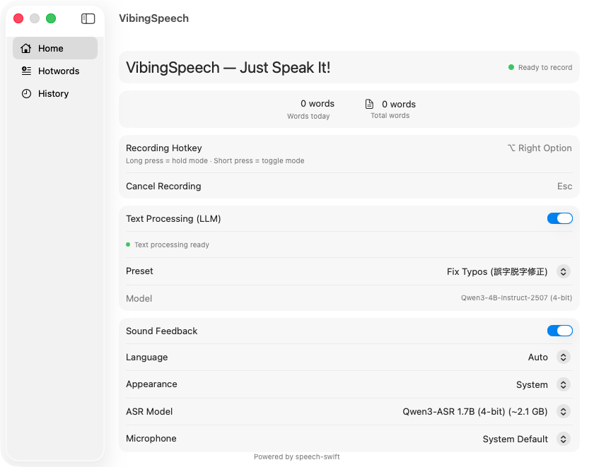
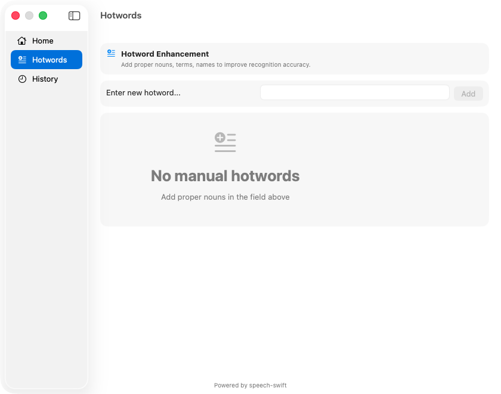
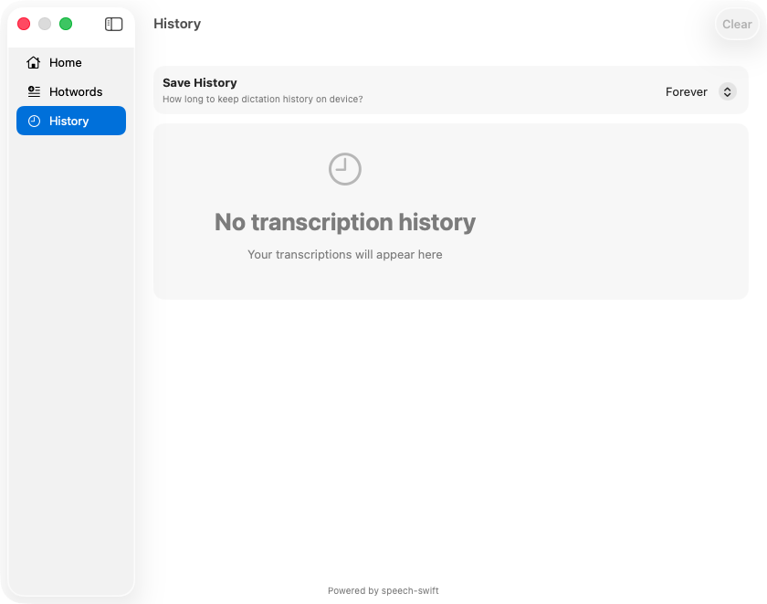

<table>
  <thead>
    <tr>
      <th style="text-align:center"><a href="README.md">English</a></th>
      <th style="text-align:center"><a href="README_jp.md">日本語</a></th>
    </tr>
  </thead>
</table>

<h1 align="center">VibingSpeech</h1>

<p align="center">
  <strong>完全にデバイス上で動作するmacOS音声入力アプリ。</strong><br>
  グローバルホットキー → 録音 → 転写（Qwen3-ASR） → オプショナルなLLMテキスト処理 → カーソル位置に貼り付け。
</p>

<p align="center">
  
  
  
  
</p>

---

## スクリーンショット

<p align="center">
  
</p>
<p align="center"><em>ホーム — ASRモデル、テキスト処理、ホットキーなどを設定。</em></p>

<p align="center">
  
  &nbsp;&nbsp;
  
</p>
<p align="center"><em>左：固有名詞・専門用語のためのホットワード辞書。右：検索可能な転写履歴。</em></p>

---

## 機能

- ✅ **グローバルホットキー** — 右Optionキーを押して録音、離すと転写（短押しでトグルモード）
- ✅ **デバイス上転写** — Qwen3-ASRモデル、クラウド通信なし、52言語の自動検出
- ✅ **ASRモデル選択** — 0.6B（8ビット、約1 GB）と1.7B（4ビット、約2.1 GB）を切り替え
- ✅ **LLMテキスト処理** — Qwen3-4B-Instruct-2507-4bitによるオプショナルなデバイス上後処理
- ✅ **処理プリセット** — 「タイポ修正」、「箇条書き」、または完全カスタムプロンプト
- ✅ **フローティングオーバーレイ** — 録音中のアニメーション波形インジケーター
- ✅ **ホットワード辞書** — 認識精度向上のためのカスタム用語追加
- ✅ **転写履歴** — 過去の転写の表示、コピー、管理
- ✅ **メニューバー常駐** — Dockアイコンなしでバックグラウンド実行
- ✅ **プライバシー重視** — すべての処理がMac上で完結、デバイス外に情報は送信されません

## 要件

- macOS 26.0+（Tahoe）
- Apple Silicon（M1以降）
- Xcode 26+ / Command Line Tools（Swift 6.2）
- **Metal Toolchain**（[Metal Toolchainセットアップ](#metal-toolchainセットアップ)を参照）

## Metal Toolchainセットアップ

Xcode 26以降、**Metal Toolchainは同梱されなくなり**、別途インストールが必要です。VibingSpeechはMLX Swiftに依存しており、ビルド時にMetalシェーダーをコンパイルします。

**Xcode UIでインストール：**

1. Xcode → Settings → Componentsを開く
2. 「Other Components」下の**Metal Toolchain**を見つける
3. **Get**をクリック

**コマンドラインでインストール：**

```bash
xcodebuild -downloadComponent metalToolchain
```

確認：

```bash
xcrun metal --version
# 期待値：metal version 32.x.x
```

> **注意：** ダウンロード後にツールチェーンが登録されない場合は、以下をお試しください：
> ```bash
> xcodebuild -downloadComponent metalToolchain -exportPath /tmp/MetalExport/
> xcodebuild -importComponent metalToolchain -importPath /tmp/MetalExport/*.exportedBundle
> ```

## ビルド・実行

```bash
git clone https://github.com/Shuichi346/VibingSpeech.git
cd VibingSpeech
make build
make run
```

`make build`はSwiftパッケージをコンパイルし、MLX Metalシェーダーライブラリ（`mlx.metallib`）をビルドします。シェーダービルドはキャッシュされ、ソースが変更された場合のみ再コンパイルされます。

スタンドアロンの`.app`バンドルを作成するには：

```bash
make app
open VibingSpeech.app

# または/Applicationsにインストール
cp -r VibingSpeech.app /Applications/
```

初回起動時、選択されたASRモデル（デフォルトの0.6Bで約1 GB）が自動ダウンロードされます。テキスト処理が有効な場合、Qwen3-4B-Instructモデル（約2.5 GB）もダウンロードされます。

## 権限

VibingSpeechには2つの権限が必要です：

1. **アクセシビリティ** — グローバルホットキー検出とテキスト挿入のため
2. **マイク** — 音声録音のため

初回起動時にプロンプトが表示されます。後で有効にするには：システム設定 → プライバシーとセキュリティ。

## 使用方法

1. アプリを起動 — メニューバーにマイクアイコンが表示されます
2. **ホールドモード：** 話している間は右Optionキーを押したままにし、完了したら離します
3. **トグルモード：** 右Optionキーを短押しして開始、もう一度押して停止
4. **キャンセル：** 録音中はいつでもEscキーを押してキャンセル
5. メニューバーアイコンをクリック → 「Show Window」で設定、ホットワード、履歴を表示

## ASRモデル選択

| モデル | ダウンロード | メモリ | 最適用途 |
|---|---|---|---|
| Qwen3-ASR 0.6B（8ビット） | 約1.0 GB | 約1.5 GB | 一般用途、高速起動 |
| Qwen3-ASR 1.7B（4ビット） | 約2.1 GB | 約3.5 GB | 複雑な音声、高精度 |

## テキスト処理（LLM）

有効にすると、転写されたテキストは貼り付け前にデバイス上のLLMで後処理されます。**無効にすると、LLMは読み込まれません** — 追加メモリなし、追加レイテンシーなし。

**モデル：** [Qwen3-4B-Instruct-2507-4bit](https://huggingface.co/mlx-community/Qwen3-4B-Instruct-2507-4bit)（約2.5 GBダウンロード、約3.5 GBメモリ）

| プリセット | 動作 |
|---|---|
| **Fix Typos** | 意味を保持しながらスペル、タイポ、文法を修正 |
| **Bullet Points** | テキストを構造化された箇条書きリストに再フォーマット |
| **Custom** | あらゆる処理タスクのためのユーザー定義システムプロンプトを適用 |

**処理フロー：** 録音 → 転写（ASR） → 言語検出 → 処理（LLM） → 貼り付け

## トラブルシューティング

### Metalシェーダービルドが失敗する

```bash
xcodebuild -downloadComponent metalToolchain
```

インストール後も`xcrun metal`が失敗する場合は、ターミナルを再起動するか正しいXcodeを選択してください：

```bash
sudo xcode-select -s /Applications/Xcode.app
```

### 実行時に`Failed to load the default metallib`

```bash
make metallib
```

### グローバルホットキーが動作しない

システム設定 → プライバシーとセキュリティ → アクセシビリティでアクセシビリティを有効にしてください。

### 開発者を確認できないためアプリを開けない

```bash
xattr -cr VibingSpeech.app
```

## アーキテクチャ

```
Sources/VibingSpeech/
├── App/              # @main、AppDelegate、AppState（中央状態）
├── Audio/            # AudioCaptureManager、TranscriptionEngine（Qwen3-ASR）
├── HotkeyManager/    # GlobalHotkeyManager（CGEventTap）
├── TextInsertion/    # クリップボード + Cmd+V シミュレーション
├── TextProcessing/   # LLMテキスト処理（mlx-swift-lm経由のQwen3-4B）
├── Persistence/      # UserDefaults設定、JSON履歴・ホットワード
├── Views/            # メインウィンドウタブ、フローティングオーバーレイ
├── Models/           # データモデル、プリセット
└── Utilities/        # 権限、音声フィードバック、アーキテクチャチェック
```

## 依存関係

| パッケージ | バージョン | 用途 |
|---|---|---|
| [speech-swift](https://github.com/soniqo/speech-swift) | ≥ 0.0.9 | Qwen3-ASR音声認識 |
| [mlx-swift-lm](https://github.com/ml-explore/mlx-swift-lm) | 2.31.3 | テキスト処理のためのLLM推論 |
| [mlx-swift](https://github.com/ml-explore/mlx-swift) | 0.31.x | MLX配列フレームワーク（共有） |

## クレジット

- **[speech-swift](https://github.com/soniqo/speech-swift)**（Apache 2.0） — Qwen3-ASR Swiftラッパー
- **[mlx-swift-lm](https://github.com/ml-explore/mlx-swift-lm)**（MIT） — LLM推論フレームワーク
- **[Qwen3-ASR](https://huggingface.co/collections/aufklarer/qwen3-asr-mlx)** — Alibaba Cloud
- **[Qwen3-4B-Instruct-2507](https://huggingface.co/Qwen/Qwen3-4B-Instruct-2507)** — Alibaba Cloud
- **[MLX Swift](https://github.com/ml-explore/mlx-swift)** — Apple Machine Learning Explore

## ライセンス

[MIT](LICENSE)
